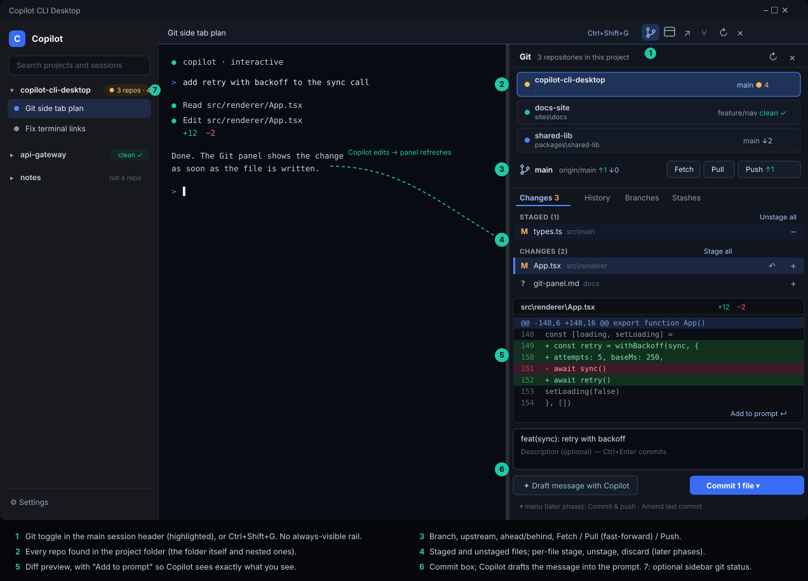

# Git side tab plan

Status: revision 10. Phase 0 (spikes, runner, parsers, #65), phase 1a (backend, #66), phase 1b (panel UI, #67), phase 2
(stage, unstage, local commit, #68), phase 3 (fetch, pull, push, #69), phase 4a (branches, #70) and phase 4b (discard, #71) are merged;
results are in [git-panel-spikes.md](git-panel-spikes.md) and the user-facing behavior is in [git-panel.md](git-panel.md).
**Phase 4 is split in three: 4a (branches) and 4b (discard) are merged; 4c (amend) is built on `feat/git-panel-phase4c`.** The plan's
list of phases is complete with 4c; what remains is the optional sidebar status setting and the "Later" items. Revision 2 came from an independent review (see
[Review log](#review-log)).



The mockup shows the Git panel docked to the right of the session area. Numbers 1–7
are explained under [What the user sees](#what-the-user-sees).

## Outcome

Add a **Git** side tab that shows the state of the Git repositories inside the active
project folder, and lets the user review and commit work without leaving the app. It
is most useful while Copilot is editing files: the change list and diff update as the
agent works, and the user can send a diff back to the prompt.

Goals:

- Find the repository or repositories under a workspace profile's folder.
- Show branch, upstream, ahead/behind, and staged / unstaged / untracked files.
- Show a diff for a file and a short commit history.
- Stage, unstage, commit, fetch, pull (fast-forward only) and push, in later phases.
- Hand context to Copilot: add a diff to the prompt, and draft a commit message into the
  prompt box. Both only insert text; the user presses Enter.

Non-goals: merge/rebase UI, conflict resolution, hunk-level staging, force push,
`reset --hard`, submodule management, split diff view, syntax highlighting, and
hosting-provider features (pull requests, checks).

## What the user sees

1. **Toggle.** A Git icon in the session pane header of the main (non-side-chat) pane,
   and `Ctrl+Shift+G`. There is no always-visible rail: the minimum window width is
   820 px and the sidebar already takes 280 px.
2. **Repository list.** One row per repo found in the project folder: name, relative
   path, branch, and a status dot (amber = changes, green = clean, blue = behind,
   red = error). With a single repo it collapses to one line.
3. **Branch and sync bar.** Branch, upstream, `↑ahead ↓behind`. Fetch / Pull / Push
   appear in phase 3.
4. **Changes tab.** Staged and unstaged groups with status letter, file name and
   folder. Stage / unstage in phase 2, per-file discard in phase 4. Other tabs:
   History (phase 1), Branches (phase 4), Stashes (later).
5. **Diff preview.** Unified diff of the selected file with **Add to prompt**. Binary
   and very large files show a notice instead of content.
6. **Commit box.** Message field, **Draft message with Copilot** (inserts a prompt),
   and **Commit** (phase 2). Commit & push and Amend arrive later.
7. **Sidebar status.** An optional setting adds `3 repos · 4` to each project row. It
   is off by default because it needs background polling (see
   [Refresh strategy](#refresh-strategy)).

## Where it fits in the current app

Verified against the code:

- `App.tsx` renders `Sidebar` and `<main class="main-content">` (a flex column that also
  hosts the compact `DiagnosticsView` and `OperationError`). `SessionWorkspace` fills it
  with `.terminal-area` (`flex: 1`).
- `SessionWorkspace` has a draggable divider (main session | side chat). `BrowserWorkspace`
  has a second copy of the same drag and keyboard logic. The Git panel would be a third,
  so extract a shared `Splitter` first (see [Files](#files-expected-to-change)).
  `.side-chat-divider` hard-codes `grid-column: 2; grid-row: 1`, so the extracted
  component needs its placement passed in.
- The per-session Browser panel is a native `WebContentsView`. It is positioned from a
  DOM rectangle measured by a `ResizeObserver` on its viewport plus a window `resize`
  listener, and sent over `desktop:browser-bounds`. It always paints above DOM.
  `obscured` is computed in `App` from `inputDialog` and `sidebarProjectsOpen` only and
  passed down to hide the view.
- `WorkspaceProfile.path` is the "project folder". Several sessions can share a
  profile, and inactive profiles' sessions keep running. The Git panel binds to the
  **profile**, not to a session tab.
- The main window minimum is 820 × 560. Terminals send `resizeTab` for any non-zero width,
  so a very narrow session area would reflow Copilot's TUI and corrupt scrollback.
- IPC handlers call `assertTrustedIpcSender`. It accepts any renderer that loads the
  app shell, including **pop-out session windows**, and throws while migration is
  exclusive. Browser handlers add an ownership check (`ownsSessionTerminal`).
- `before-quit` returns early unless a session, the usage service or a browser exists,
  so a new service must be added to that condition and to the shutdown chain.
- Helpers that exist: `windowsSystemExecutable`, `findWindowsExecutable` (absolute `.exe`
  via `where.exe` from System32, exported from `resolve-copilot.ts`),
  `isLocalFilesystemPath`, `isPathWithinRoot` (lexical only), `redactDiagnosticText`,
  `startWindowsProcessWatchdog`, and the `taskkill` call in `pty-session.ts`. The
  `execFileAsync` instances are private to each file, so there is no shared runner to
  reuse.

## Layout

The panel belongs to the project, so it lives at the `main-content` level, to the right
of `SessionWorkspace`, in a new `ProjectDock` grid (`flex: 1; min-height: 0`).

- **Width:** `maxGitWidth = available − MIN_SESSION_WIDTH (480 px)`, minimum 320 px.
  Re-clamp the stored value (`git-panel-width`, `try/catch` like `side-chat-split`) on
  window resize. Open state is stored as `git-panel-open`.
- **Narrow windows:** when `available < 320 + 480`, the panel replaces the session area
  (with a "Back to session" button) instead of squeezing it. It is not an overlay: an
  overlay would sit under the native browser view.
- **Native browser view:** the panel and the session area are separate grid columns, so
  they do not overlap. `browser-bounds` travels by async IPC, so the view can lag one
  frame while the divider is dragged. The integration check must assert the **final**
  bounds after the drag.
- **`obscured`:** any popover that can open above the browser region (the Commit menu,
  later dialogs) needs the view hidden. Replace the prop drilling with a small
  `ObscureContext` that `App` and the panel both write to, and that `BrowserWorkspace`
  reads. Confirmations for destructive actions are native dialogs from main (see
  [Destructive actions](#destructive-actions)), which avoids this for them.
- **Pop-out windows:** v1 shows the panel in the main window only. The header toggle is
  not rendered in `SessionWindow`.
- **Side chat:** the toggle appears only on the main pane header, so it is not duplicated
  when a side chat is open.

## Architecture

```
renderer                         preload              main (main window only)
GitPanel.tsx ──────────────────► copilotDesktop.git* ► ipcMain 'desktop:git-*'
  useGitRepos(profile)                                    │ sender = main window, profile and repoId validated
                                                          ▼
                                                    git-service.ts   (state per canonical project path,
                                                          │           refcounted subscriptions, op queue)
                                       ┌──────────────────┼───────────────────┐
                                       ▼                  ▼                   ▼
                                git-discovery.ts    git-runner.ts      git-parse.ts
                                (find repos)        (spawn git.exe)    (pure parsers)
```

### New main-process modules

| Module | Responsibility |
| --- | --- |
| `git-types.ts` | Serializable types shared with the renderer (phase 1; the parsers currently export their own types). |
| `git-env.ts` | **Done.** Pure builders for the hardened argument prefix, the allowlisted environment and the ceiling directory. |
| `git-commands.ts` | **Done.** Argument lists for `status`, `diff`, `log` and `rev-parse` with the read-safety flags built in. |
| `git-runner.ts` | **Done.** The only place that starts git. Resolves an absolute `git.exe`, uses `spawn`, owns the timeout, caps stdout and stderr, supports stdin and `AbortSignal`, kills the process tree and waits for the kill to finish, and registers children with the process watchdog. |
| `git-parse.ts` | **Done.** Pure parsers for `status --porcelain=v2 -z --branch`, `log`, `--numstat`, version text, and bounded diff text. |
| `git-discovery.ts` | Finds repos for a profile. |
| `git-trust.ts` | Per-repo trust decisions (see [Repo trust](#repo-trust)). |
| `git-service.ts` | Canonical-path keyed state, refcounted subscriptions, refresh scheduling, per-repo write queue, events to the renderer. |

### Running git safely

**Resolve one absolute `git.exe`** (`resolveGitExecutable`). Never spawn the bare name `git`: on Windows the child's
working directory can be searched before `PATH`, so a repository containing `git.exe` or
`git.cmd` could run on every poll. The code already treats workspace contents as
untrusted (`SECURITY.md`, `findWindowsExecutable`). Resolve with `findWindowsExecutable('git')`
(falling back to `%ProgramFiles%\Git\cmd\git.exe`), cache it, re-resolve on `ENOENT`, and
record the version. The minimum is git 2.30 (`MIN_GIT_VERSION`; the plan relies on
`--pathspec-from-file` / `--pathspec-file-nul`, 2.25+). Only 2.55 has been run so far.

**Hardened prefix for every read** (`git-env.ts`):

```
--no-pager --no-optional-locks --literal-pathspecs
-c core.fsmonitor=false -c core.hooksPath=<empty dir under userData>
-c core.quotepath=off -c color.ui=false -c log.showSignature=false
-c gc.auto=0 -c maintenance.auto=false -c i18n.logOutputEncoding=UTF-8
```

plus `--ignore-submodules=all` on status, and `--no-ext-diff --no-textconv` on diff, show
and log. Never use `%G` log placeholders.

**Environment from an allowlist**, not inherited. Remove every `GIT_*`, `NODE_OPTIONS` and
`ELECTRON_RUN_AS_NODE`. Set `GIT_OPTIONAL_LOCKS=0`, `GIT_TERMINAL_PROMPT=0`,
`GCM_INTERACTIVE=never`, `GIT_NO_LAZY_FETCH=1`, `SSH_ASKPASS_REQUIRE=never`,
`GIT_EDITOR=true`, `GIT_PAGER=cat`, `LC_ALL=C`. If the user has not configured
`GIT_SSH_COMMAND` or `core.sshCommand`, set `GIT_SSH_COMMAND=ssh -o BatchMode=yes` so a
host-key or passphrase prompt fails fast instead of hanging.

**Paths and arguments.**

- `--literal-pathspecs` on every call, so a file named `*.ts` or `:(exclude)x` cannot
  expand to other files. After `--`, a leading `-` is harmless, so do not reject it.
- Bulk paths go over stdin with `--pathspec-from-file=- --pathspec-file-nul`. Command
  lines are limited to about 32 K characters on Windows, and "Stage all" can cover
  thousands of files. Cap path count and length at the IPC layer.
- Renderer-supplied paths are never used directly. Main keeps a map from entry id to path
  from the last status, and mutations carry the status **generation number** the user saw.
  A stale generation is rejected and the panel refreshes.
- Branch names are validated as `refs/heads/<name>` with `git check-ref-format` and passed
  after `--end-of-options`. Note that `check-ref-format --branch` also accepts `@{-N}`.
- Commit messages go through stdin with `commit -F -`.

**Timeouts and process tree.** `execFile` is not enough: its timeout kills only
`git.exe`, not `git-remote-https`, `ssh`, credential helpers or hooks, `maxBuffer` rejects
instead of truncating, and it has no stdin option. The runner uses `spawn`, its own timer,
and `taskkill /PID <pid> /T /F` through `windowsSystemExecutable`. It registers each child
with `startWindowsProcessWatchdog` so a crash does not orphan a `push` or `commit`. Timeout
classes: 15 s for reads, 120 s for network, and for commit/amend a longer limit with a
**Cancel** button and streamed hook output, because `pre-commit` hooks can take minutes.

### Repo trust

Read-only commands on an untrusted repository can still run programs it configures:
clean/smudge/process filters, `diff.<driver>.textconv`, `core.fsmonitor`, `gpg.program`,
and `.git` files or config that point at a UNC share (which leaks an NTLM hash). The
hardened prefix above disables most of these, but not every attribute-driven filter, and
write and network operations run `core.sshCommand`, `credential.helper`, hooks, merge
drivers and more. So:

1. Before the first command in a repo, read its own config without running anything:
   `git config --local --worktree --show-origin -z --get-regexp` for the families
   `core.(fsmonitor|sshcommand|hookspath|worktree|askpass|gitproxy)`, `filter.*`,
   `diff.*.(command|textconv)`, `merge.*.driver`, `credential.*`, `gpg.*`, `include*`,
   `url.*`, `remote.*.(vcs|proxy|*pack)`.
2. If any are present, the repo is shown as **"Needs review"** with the list. Nothing but
   that list is read until the user clicks **Trust this repository**. The decision is
   persisted by canonical path and config hash in `desktop.json`, and re-asked if the
   config changes.
3. Parse a `.git` file (4 KB cap) and require a local `gitdir:`; reject UNC and device
   paths for `gitdir`, `commondir`, `core.worktree` and `include.path`.
4. Write and network operations always run in a clean config scope: no
   `core.hooksPath` override is applied for the user's own commit hooks, but the user
   gets a one-line notice the first time a repo's hooks run from Desktop.

This is not a sandbox: Copilot CLI itself runs git in the same folder. The goal is that
**Desktop does not run repo-controlled programs on open, before any consent, on a timer.**

### Repo discovery

1. In the profile path, `git rev-parse --show-toplevel`, first **without** a ceiling to learn whether
   the profile sits inside a larger repo. A ceiling on a proper ancestor stops discovery at and above
   that folder (spike 2), so a second call with `GIT_CEILING_DIRECTORIES` set to the profile's parent
   (`ceilingDirectories()`) is used to scan only within the project. If the profile is inside a larger repo, show that repo and say
   so. **Guard:** if the toplevel is a drive root, the user's home directory, or otherwise
   an ancestor outside the profile, show it as "Parent repository" with
   `--untracked-files=no` and a count only, never a full scan of the home directory.
2. Scan child directories to depth 3 for a `.git` entry (directory or file, so linked
   worktrees are found), without descending into a repo. Skip `node_modules`, `dist`,
   `build`, `release`, `.venv`, `target`, `.next`. Cap 25 repos, 2,000 directories, 3 s,
   with a **Rescan** action. Junctions are not followed; the UI says "Linked folders are
   not scanned".
3. Use `fs.realpath.native` on **both** the profile root and each candidate before
   comparing. The JS `realpath` does not expand 8.3 short names (`RUNNER~1`), so tests on
   GitHub's Windows runner would otherwise report "outside root". Compare case-insensitively.
4. UNC and `\\wsl$\` profiles are refused with an explicit message.
5. Repo ids are opaque, monotonic and **never reused**, so a rescan cannot make a stale
   `repo-3` point at a different repository.
6. Key service state by canonical lowercased `realpath.native`, not `profileId`, because
   differently cased paths hash to different ids.

### Refresh strategy

- **No git process runs while the panel is closed** (default). The rail count from the first
  draft is gone. The optional sidebar status setting polls on a separate slow timer
  (30 s, one repo at a time, at most the 20 profiles the app allows) and is clearly labelled.
- While the panel is open and the window is visible, refresh on:
  - session activity events the app already parses (`tool.execution_*`, turn end),
    debounced 300–500 ms;
  - window focus and a manual refresh;
  - a slow fallback every 20 s.
  The first draft's "fast poll while a session is working" is dropped: `tab.activity` is
  optional and often null (older CLIs, remote sessions, after replay). Fall back to
  `lastActivityAt` when it is.
- Adaptive spacing: `next = max(interval, 3 × lastDuration)`; at most one status in flight
  per repo; show last known data with a "refreshing" indicator.
- Pause on window `hide` / `minimize`, including tray mode (`closeBehavior: 'tray'`
  leaves the app running with sessions active). Pause while migration is exclusive.
- Status output is capped (5,000 entries); beyond that show a count only. Consider
  `--no-ahead-behind` for very large repos.
- Agent edits touch the worktree, not `.git/index`, so an index watcher does not help and
  is dropped. A recursive `fs.watch` is possible on Windows but needs ignore filtering and
  handles buffer overflow poorly; revisit only if events prove insufficient.

### Lifecycle and IPC

- **Subscriptions are refcounted per `webContents.id`.** They are torn down on
  `destroyed`, `render-process-gone`, window hide, and app shutdown. A renderer reload
  never leaves a poller or child process behind. `git-close` becomes a courtesy, not the
  cleanup mechanism.
- **Main window only.** Git handlers check the sender against `mainWindow.webContents`
  after `assertTrustedIpcSender`, so a pop-out renderer cannot start work.
- **Shutdown.** Add the git service to the `before-quit` early-return condition and to the
  cleanup chain so in-flight children are killed.

| Channel | Arguments | Result |
| --- | --- | --- |
| `desktop:git-open` | `profileId` | Repo summaries; starts a subscription |
| `desktop:git-close` | `profileId` | Releases it |
| `desktop:git-rescan` | `profileId` | Repo summaries |
| `desktop:git-trust` | `profileId`, `repoId`, `configHash` | Updated summary |
| `desktop:git-status` | `profileId`, `repoId` | `GitStatus` with `generation` |
| `desktop:git-diff` | `profileId`, `repoId`, `entryId`, `staged` | `GitDiff` (capped) |
| `desktop:git-log` | `profileId`, `repoId`, `limit`, `skip` | `GitLogEntry[]` |
| `desktop:git-stage` / `git-unstage` | `profileId`, `repoId`, `entryIds[]`, `generation` | `GitStatus` (phase 2) |
| `desktop:git-commit` | `profileId`, `repoId`, `message`, `generation` | `GitOperationResult` (phase 2) |
| `desktop:git-sync` | `profileId`, `repoId`, `'fetch' \| 'pull' \| 'push'` | `GitOperationResult` (phase 3) |
| `desktop:git-checkout`, `git-discard` | see phase 4 | phase 4 |
| `onGitChanged` event | — | `{ repos }`, sent to the main window |

### Diff semantics

- Tracked changes use `git diff` / `git diff --cached` with `--no-ext-diff --no-textconv`.
- **Untracked files** have no `git diff`. Read them in main only after `lstat` (reject
  symlinks, junctions and other reparse points), `realpath.native` containment in the
  repo, alternate-data-stream and device-name rejection, a size cap, and binary detection.
  `--untracked-files=normal` collapses to `dir/` entries; the list shows a directory as
  one row, and stage/discard act on it explicitly.
- Path bytes from `-z` are decoded as UTF-8. Names that are not valid UTF-8 are shown with
  a replacement marker and are never round-tripped from the renderer: main resolves them
  from its own map.
- Diffs and untracked content that look like secrets (`.env`, `*.pem`, `id_*`, and lines
  matching the patterns in `redactDiagnosticText`) are masked in **Add to prompt**, and
  the panel says so.

### Add to prompt

`insertIntoPrompt` is a renderer-local `window` event, and `promptInsertText` slices at
12,000 characters, so a marker appended at the end would be cut off. Therefore:

- Truncate inside the panel to about 11 KB with the "truncated" marker included. Without
  bracketed paste, line breaks become ` | `, so the panel warns that the diff will be
  flattened if the terminal does not support it.
- Show which tab receives the text. If the target session is popped out, disable the
  button with a tooltip: the panel is in the main window and the event cannot reach it.
- **Draft message with Copilot** uses the same path: it inserts a prompt with the staged
  `--stat` and a capped diff, asks for a conventional-commit message, and sends nothing.

### Destructive actions

- Confirmation is a **native `dialog.showMessageBox` from the main process**, parented to
  the window, listing the exact files. A renderer-minted `confirmToken` would be theater,
  so the first draft's token is removed. This also avoids the `obscured` problem.
- `git restore` of tracked changes is irreversible. Before discarding, snapshot the files
  to `userData` (or `git stash create` into a private ref) and require that the file's hash
  or mtime still matches what the user saw, because the agent may have rewritten it.
- Untracked files go to the Recycle Bin with `shell.trashItem` after the `lstat` and
  containment checks above. `shell.trashItem` is not used anywhere in the app today and
  its junction behavior is unverified (see [Spikes](#spikes)).
- "Discard all" and untracked deletion are deferred to the end of phase 4.
- No force push, no `reset --hard`, no `clean`.
- `checkout` changes the worktree under a live agent, so it is blocked while any session
  in the project is working (using `lastActivityAt` when `activity` is unavailable) and
  asks for confirmation otherwise.

### Write operations

- Per-repo FIFO queue. If git reports `index.lock`, back off and wait up to about 10 s
  (Copilot or a commit hook may hold it legitimately), then show "another git process is
  running". Never delete the lock.
- Check `user.name` / `user.email` before commit and explain how to set them. Show
  `commit.gpgsign` failures verbatim. Treat the **exit code as truth**: with
  `core.autocrlf=true` git prints LF/CRLF warnings on stderr and still exits 0.
- Authentication failures say "authentication required; run `git fetch` in a terminal".
  The app never asks for, stores or logs credentials. Remote URLs and error text go through
  an extended `redactDiagnosticText` (add `ssh://user:pw@` and `insteadOf`-rewritten
  forms) **before** `writeAppLog`, IPC errors and events.
- On `safe.directory` errors show the message and the exact one-line fix; never edit global
  config.
- If git is missing, show an install hint; the rest of the app is unaffected.

## Phases

### Phase 0 — spike (done; branch `feat/git-panel-phase0`, no UI)

Built `git-env`, `git-commands`, `git-runner` and `git-parse` with tests, settled the
[Spikes](#spikes) that could be measured, and set the minimum git version. See
[git-panel-spikes.md](git-panel-spikes.md). Not yet merged.

### Phase 1 — read-only review

Delivered in two pull requests. **1a (backend, done):** `git-discovery`, `git-trust`, `git-untracked`, `git-service`,
`git-ipc`, `git-types`, the `main.ts` wiring (activity, focus, hide/minimize, quit), the preload bridge, and
`scripts/git-ipc-check.mjs`. **1b (UI, next):** `ProjectDock`, `Splitter`, `ObscureContext`, `GitPanel` and its parts, the
header toggle and shortcut, persistence, Add to prompt and Draft message, and the panel's Electron check.

- Single repo from `rev-parse` first, then nested discovery; repo list; status; diff;
  History; trust gate for repos that need review.
- `ProjectDock`, header toggle, shortcut, persistence, `Splitter` extraction.
- **Add to prompt** and **Draft message with Copilot** (both insert text only).
- Event-driven refresh and lifecycle teardown.

Ship this when it is useful on its own: review what Copilot just changed.

### Phase 2 — stage, unstage, local commit (done)

Stage/unstage with the stdin pathspec path, commit with identity pre-check, hook output
streaming and Cancel, `index.lock` backoff.

Delivered, with these decisions made while building it:

- **Hooks need approval, which the plan had not required.** A commit runs the repository's own hook files, and the config trust
  check cannot see them (an unpacked archive can carry a hostile `.git/hooks/pre-commit`). A commit therefore lists the hooks
  a commit can run and waits for approval of their exact contents (a hash of names and file contents, stored beside the config
  trust and asked again when anything changes). Staging and unstaging run with hooks switched off.
- **A bug the tests caught on the way:** the first version found the hooks folder through a read-mode git command, which
  redirects `core.hooksPath` to an empty folder, so every repository looked hook-free and the commit ran its hooks unapproved.
  The lookup now asks git without the override (a regression test covers it).
- **Writes quote the file list they were made from** (a generation number) and are checked again when their turn comes in the
  per-repository queue, so a click cannot affect a different file than the one shown.
- **Lock handling:** wait up to ten seconds for another process's `index.lock`, then report it as busy; never delete it. After a
  Cancel the message tells the person which file to delete if one remains.
- Commit messages travel on stdin (`commit -F -`), paths on stdin NUL-separated, and the commit never uses `--no-verify`.
- Progress from a running write streams to the panel (colour codes and carriage returns are removed for display).

Not in phase 2: amending, discarding, and any network operation.

### Phase 3 — network

Fetch, pull `--ff-only`, push (set upstream after confirmation), and the credential-failure message. Built as one IPC channel
(`desktop:git-sync`: `fetch`, `pull` or `push`, plus a remote name for a first push), one service method that all three share,
and a sync bar under the branch name. The design decisions, each with a test that fails without it:

- **The address is checked before every contact.** It comes from the repository's own config, so `remote get-url` resolves it
  (after `insteadOf`/`pushInsteadOf`) and `checkRemoteUrl` refuses a network share (`\\server\share`, `//server/share`,
  `file://server/..`, `file:////server/..`; Windows would send credentials to open it), a `name::address` helper (`ext::` runs a
  program), an unknown protocol, and a host that starts with `-` (`ssh` reads it as an option). On top of that,
  `GIT_ALLOW_PROTOCOL=http:https:ssh:git:file` limits what git itself will start.
- **Pull is fetch, then `merge --ff-only @{upstream}`.** Two commands, so each has its own failure meaning, the second one waits
  for `index.lock` like every write, and the trust gate is checked again between them. A pull that cannot fast-forward changes
  nothing ("diverged"); merging and rebasing stay in the terminal.
- **Push uses an explicit refspec** (`refs/heads/<b>:refs/heads/<b>`), which overrides `remote.<name>.push`, and never a `+` or
  `--force`. It also passes `--no-recurse-submodules --no-follow-tags --signed=no`, so config cannot make a push do more (push
  submodules, run `gpg`). A branch whose upstream has a different name is refused: git's own `push.default=simple` refuses the
  same, and pushing it from a button would hide where it goes.
- **A branch without an upstream asks first.** `needs-upstream` carries the remote names; the panel shows a confirmation naming
  the branch and remote, and only then sends `--set-upstream`. The remote must be one of the repository's configured remotes.
- **Hooks.** Network commands run with `core.hooksPath` redirected, so `post-merge`, `post-checkout` and `reference-transaction`
  do not run on a pull. A `pre-push` hook is a guard, so a repository that has one is refused (`hooks-unsupported`) rather than
  pushed around it. (Approving it like a commit hook is possible later; the approval store holds one hash per repository today.)
- **No credentials, fast.** `GIT_TERMINAL_PROMPT=0`, `GCM_INTERACTIVE=never` and `SSH_ASKPASS_REQUIRE=never` were already set;
  `GIT_SSH_COMMAND=ssh -o BatchMode=yes` is added only when `core.sshCommand` (read from the effective config, including the
  global one) is unset and the user has no `GIT_SSH`/`GIT_SSH_COMMAND`, because that variable outranks the setting. Failures
  that mean "credentials or host key" (`terminal prompts disabled`, `Authentication failed`, `Permission denied (`, `Host key
  verification failed`, HTTP 401/403 and a few more) become `auth-required` with "run `git fetch` in a terminal".
- **A fetch writes only where it says it does.** It applies every `remote.<name>.fetch`, so those settings are read first
  (`checkFetchRefspecs`) and a destination outside `refs/remotes/<remote>/` refuses the fetch; the command also overrides pruning
  (`--no-prune --no-prune-tags`, against `fetch.prune`) and writes no tags. Found by the first review: a configured
  `+refs/heads/main:refs/heads/backup` reset a local branch. Git itself refuses `--mirror` together with a refspec, so a
  `remote.<name>.mirror` setting cannot turn the explicit push into a mirror.
- **Confirmations are bound to what was shown.** `desktop:git-sync` carries the branch and its commit for a pull or push, and main
  compares them with the freshly read state before doing anything (`GitStaleError`), so a confirmation for one branch cannot
  publish the branch another tool switched to. The Publish dialog keeps the branch and commit it was asked about and hides if
  they change. The second review round showed that a check at the start is not enough, because a fetch can take two minutes: a pull
  now re-reads the current branch and commit after the fetch and before every merge attempt (`GitStaleError` if they differ) and
  merges the confirmed branch's tracking ref by its full name instead of `@{upstream}`; a push uses the confirmed commit id as the
  refspec source instead of the branch name, so nothing committed after the click is sent. Because `--set-upstream` needs a branch
  name as its source, a publish writes `branch.<name>.remote` and `.merge` itself after the push succeeds. The remaining window is
  the few milliseconds between the re-read and git's own ref update on a pull; git offers no compare-and-swap for a merge.
- **Redaction.** `redactDiagnosticText` now also removes `user:password@` from any scheme (`ssh://`, `git://`), and the progress
  stream is redacted as well as the final result.
- **Cancel and limits.** Same cancel and process-tree kill as a commit; 120 seconds for the network; one write at a time per
  repository, and the repository list stays locked while one runs.

Not in phase 3, on purpose:

- **The optional sidebar status setting.** It needs git to poll in the background while the panel is closed, which the panel
  promises not to do. It can come later as an explicit opt-in with its own budget.
- **Gating Pull on session activity.** The plan gates `checkout` (phase 4) because it can rewrite many files under a working
  agent. A fast-forward only touches files that differ between two commits and git refuses it when a local change is in the way;
  if that proves too loose in practice, the activity check built for checkout can be applied to Pull too.
- Approving a `pre-push` hook, pushing a differently named upstream, pruning, tags, force.

### Phase 4 — branches and destructive actions

Branch list, create, checkout (gated as above), amend, per-file discard with snapshot and
native confirmation. "Discard all" and untracked deletion last. Delivered in two pull requests: **4a (branches)** and **4b (amend and
discard)**, so the riskiest, data-losing half gets its own review.

#### Phase 4c — amend

Amend is a mode of the existing commit path, not a second implementation (`desktop:git-amend` and a read, `desktop:git-head-commit`,
that gives the box the last message and where it is published), so it inherits the staged-contents comparison, the hidden-staged
refusal, the identity check and the hook approval. What it adds, each with a test that fails without it:

- **Only an unpublished commit.** `for-each-ref --contains HEAD refs/remotes` (a remote's `HEAD` pointer is not a branch and is
  ignored); any hit refuses with `published`, because the only way to publish the result would be a force push. Merge commits are
  refused (`rev-list --parents`).
- **Bound to the commit on screen, repeatedly.** The request carries the branch and commit id, compared after the queue turn, and
  again in the per-attempt callback together with the published test, because `commit --amend` rewrites whatever `HEAD` is when it
  runs and a lock wait or a fetch can change that (the lesson of phases 3 and 4).
- **`post-rewrite` joins the commit hooks** that are inventoried and approved: an amend runs it, and without that a repository's
  hook could run unapproved. An existing approval is asked for again once, as the inventory changes.
- **Git's guard against empty commits stays,** except `--allow-empty` is passed when the last commit is already empty (its tree
  equals its parent's), which is what lets such a commit be reworded. The Electron check found this one.
- **UI:** a checkbox in the commit box (or an "Amend last commit…" button when the box is closed), the last message prefilled only
  once the info for the *current* commit has loaded (also found by the Electron check: a stale cache from the previous commit
  prefilled the wrong text), and a disabled button with the reason for a published or merge commit.

#### Phase 4b — discard

One write channel (`desktop:git-discard`: entry ids and the file-list generation), a **↶** button per row and **Discard all** per
group, and three service options (`confirm` with a `danger` flag, `snapshotDirectory`, `trash`) that `main.ts` supplies
(`dialog.showMessageBox` of type warning with Cancel as the default, `userData/git-discarded`, `shell.trashItem`). Any of them
missing means the discard is refused: it fails closed. Decisions, each with a test that fails without it:

- **Recoverability instead of a view-time hash.** The plan asked for the file's hash to match what the person saw. The panel does
  not hash files at view time, and the list version (generation) cannot see a content edit to an already-modified file. What the
  design guarantees instead is that **the copy saved is exactly what the restore throws away**: the copy is made after the answer,
  from the file on disk, each file is measured before and after its copy (a change stops the discard), and the restore follows
  immediately. Work an agent added after the person looked is therefore in the copy.
- **Check, ask, check again, and again before every attempt.** The first review round found that "again" was not enough: a restore can
  wait ten seconds for `index.lock`, and the copy, the session check and the path checks had been made once before it. They now run
  in the per-attempt callback; the copy is made there too and is re-made when the files' stamps (size and modification time) differ
  from the ones it recorded, so new work is saved rather than overwritten by an older copy. The review also showed that a
  junction in a *parent* folder passes a leaf-only check and that Git does not stop a write through it: every folder above a path
  is now `lstat`ed (a link anywhere is refused) and the nearest existing one must resolve inside the repository, for tracked and
  untracked paths alike. Each untracked item is re-checked immediately before it is moved.
  A second review round found that the stamps were kept in a plain object keyed by file name, so a tracked file called `__proto__`
  was never stored and its changes went unnoticed: they are a `Map` now, and the commit-message drafts the panel keeps per
  repository folder are read with an own-property check for the same reason. Any dictionary keyed by a path needs this.
- **Check, ask, check again.** Everything that can make a discard unsafe (session working, copies too large or not regular files,
  an untracked folder that holds a repository or is too big to inspect, unsafe names, links) is evaluated before the window opens,
  so nothing impossible is offered, and again after it closes together with the trust gate, the list version and the session.
  Refusals are all-or-nothing for the request.
- **Untracked is the dangerous half.** `checkTrashable` refuses a link or junction, a path that resolves outside the repository, a
  reserved or stream name, anything under `.git`, and a folder containing a `.git` entry at any depth (walked without following
  links, capped at 20,000 items). `shell.trashItem` (spike 4: removes only a link, rejects `file:stream`) does the deletion, one item
  at a time, reporting failures per item.
- **`git restore --worktree --no-recurse-submodules` from stdin** (`--pathspec-from-file=- --pathspec-file-nul`), so the index is
  untouched: a staged version survives. Hooks are off. It waits for `index.lock` like any write.
- **Retention:** the newest 30 copies; only folders this code created (matching its own name pattern) inside the copies folder are
  ever pruned.
- **Not in 4b:** discarding staged changes (unstage first), conflicts, submodules, an "undo" button that restores a copy (the message
  names the folder), and `Discard all` across both groups at once.

#### Phase 4a — branches

One read channel (`desktop:git-branches`) and one write channel (`desktop:git-branch`: `create` or `switch`, a branch name, and the
current branch and commit the person was looking at), a Branches tab, and two new service options. Decisions, each with a test that
fails without it:

- **Create is free, switch is gated.** Creating a branch at HEAD changes no file, so it only needs a valid name (the panel's rules,
  then `git check-ref-format refs/heads/<name>` on the literal name so `@{-1}` shorthand is never expanded). Switching rewrites files
  under whatever is working in the folder, so `GitServiceOptions.sessionActivity` decides first and `confirm` (a native
  `dialog.showMessageBox` parented to the main window, supplied by `main.ts`) asks second. Without `confirm` the switch is refused:
  it fails closed.
- **What counts as "working"** (`projectActivity`, pure and tested): a live tab of this workspace that is `working`, `starting`,
  `approval-needed`, or `running` with no activity signal and output in the last 60 seconds. Observed `idle` wins over recent output.
- **The lesson from phase 3 applied from the start:** a confirmation window can stay open for a long time, so before every attempt of
  the switch (after the answer, and on each `index.lock` retry) main re-checks the trust gate, that HEAD is still the confirmed
  branch at the confirmed commit (`GitStaleError`), and that no session has started working.
- **Git stays the safety net:** `git switch --no-guess --no-recurse-submodules <branch>` with no `--force`, `--merge` or
  `--discard-changes`; an overwrite is refused by Git and reported as `local-changes` with "Nothing was changed". The target must be in
  the freshly read local branch list and not the current one. Hooks are switched off (`post-checkout` would run a repository program).
- **Not in 4a:** remote branches, deleting or renaming a branch, and the amend/discard half (4b).

### Later

Stashes, tags, open file in editor, hunk staging, a popped-out-window panel.

## Files expected to change

New:

- `src/main/git-types.ts`, `git-env.ts`, `git-runner.ts`, `git-parse.ts`, `git-discovery.ts`,
  `git-trust.ts`, `git-service.ts`, each with a `*.test.ts`.
- `src/renderer/components/ProjectDock.tsx`, `Splitter.tsx`, `GitPanel.tsx`,
  `GitChanges.tsx`, `GitDiffView.tsx`, `GitHistory.tsx`, `GitIcon` in `Icons.tsx`,
  `ObscureContext`.
- `src/renderer/git-state.ts` (hook and reducers). Its tests live under `src/main`
  (see [Tests](#tests)).
- `docs/git-panel.md` (user documentation, when phase 1 ships).
- `scripts/git-panel-check.mjs`.

Modified:

- `src/main/main.ts`: handlers, service lifetime, `before-quit`, shutdown chain, menu
  accelerator for the shortcut.
- `src/main/resolve-copilot.ts`: only if a small export is needed for git resolution.
- `src/main/desktop-diagnostics.ts` and its test (fixed `DiagnosticsInput` fields): add git
  version and repo count, never remote URLs.
- `src/main/desktop-config.ts` and its test: persisted repo trust decisions (and the
  optional sidebar status setting). Drop the "configurable skip list" idea.
- `src/preload/preload.cjs`, `src/renderer/global.d.ts`.
- `src/renderer/App.tsx`, `SessionWorkspace.tsx`, `BrowserWorkspace.tsx` (use `Splitter`
  and `ObscureContext`), `styles.css` (existing palette: `#10151e` panel, `#4f88ff`
  accent, `#ffb84d` changed, `#20c9a6` added).
- `package.json` (`git:check` script), `.github/workflows/ci.yml` (run it and upload
  `test-results/git-panel/`), `README.md`.
- Not `docs/FEATURE_PARITY.md`: that file compares against another product, and a Git
  panel is not a parity item.

## Tests

Main-process modules pair `x.ts` with `x.test.ts` and run through `npm test`. Renderer
code is excluded from `tsconfig.build.json`, so renderer tests live under `src/main`
(like `sidebar-render.test.tsx` and `desktop-view-state.test.ts`); a test next to a
renderer file would silently never run.

Fixtures: create repos with real `git init`, isolated with `GIT_CONFIG_GLOBAL`,
`GIT_CONFIG_NOSYSTEM`, explicit `user.name`/`email`, and a pinned `init.defaultBranch`.
Submodule fixtures need `-c protocol.file.allow=always`. The runner is on a recent git;
the pinned minimum version also gets one run.

- `git-parse`: porcelain v2 with renames, spaces, unicode, newline in names, unmerged
  entries, detached HEAD, no upstream, initial commit, the 5,000-entry cap, CJK and
  non-UTF-8 names.
- `git-env` and `git-runner`: the exact prefix and the allowlisted environment, no shell
  interpretation of `& | ; $()`, stdout cap truncates (not rejects), stdin round-trip with a
  leading `-` and non-ASCII text, timeout kills the **tree** (a hook that sleeps), and a
  planted `git.exe` and `git.cmd` in the repo root never run.
- Pathspec safety: files named `*`, `[a]`, `:(top)`, `:!x`; more than 32 K characters of
  paths via stdin; stale generation rejected.
- **Malicious-repo fixtures** that assert a sentinel file is never created by a read:
  `core.fsmonitor`, a clean `filter`, `diff.*.textconv`, `log.showSignature` with a fake
  `gpg.program`, a `.git` file with a UNC `gitdir`. Plus a trust-gate test: config change
  re-prompts.
- `git-discovery`: profile is a repo, contains repos, is inside a repo, is inside the home
  directory repo, linked worktree, submodule, depth and count caps, a junction (`mklink /J`
  needs no admin), 8.3 short names and case-different profile path, UNC refused, ids never
  reused across rescans.
- `git-service`: refcounted subscriptions, teardown on `destroyed`,
  `render-process-gone`, hide/minimize and migration exclusivity, no polling while closed,
  coalesced refresh, per-repo write order, `index.lock` held by another process, quit
  mid-push kills children.
- IPC validation: wrong sender (pop-out renderer), bad `repoId`, oversized inputs, stale
  generation.
- Redaction: `https://user:pw@`, `ssh://user:pw@`, tokens, `insteadOf`, applied before logs.
- Renderer render tests for loading, no git, no repos, single, many, clean, dirty, needs
  review, error, truncated; Add-to-prompt truncation including the marker; disabled for a
  popped-out tab.
- `scripts/git-panel-check.mjs` (Electron): two-repo fixture, open the panel with the
  terminal focused **and** with the browser view focused (shortcut must work in both), edit
  a file and see it appear, stage and commit (phase 2), drag the divider and assert the
  final browser bounds, open the Commit menu with the browser panel open and assert the view
  is hidden, reload the renderer and assert no git process remains. Evidence goes to
  `test-results/git-panel/`.
- CI: add the script after the earlier build/test steps (like `sidebar:check`, which has no
  build step of its own), and add `test-results/git-panel/` to the explicit upload list in
  `ci.yml`. Not every Electron check runs in CI today (`activity:check`, `popout:check`,
  `paste:check` do not), so do not assume pop-out is covered.
- Performance fixture of about 50,000 files to measure `status` and the adaptive refresh.

## Spikes

Results are in [git-panel-spikes.md](git-panel-spikes.md).

1. **Shortcut delivery — decided, proof in phase 1.** Handle it with `before-input-event` on the main window
   (independent of xterm) and forward it from the native browser view, where `Ctrl+Shift+G` had no meaning
   (find-next is `Ctrl+G`/`F3`, find-previous is `Shift+F3`), so it toggles the panel in every state. Implemented in
   1b: the browser-view half is asserted in `browser-basics-check`, and the main-window half in `git-ipc-check` (the real
   main process receives the key and the page gets the toggle; near-miss chords do not). Not covered: a live xterm
   holding focus, which `before-input-event` pre-empts by design.
2. **`GIT_CEILING_DIRECTORIES` on Windows — works.** A proper-ancestor ceiling stops discovery at that folder;
   a ceiling equal to the working folder is ignored; slash style does not matter.
3. **Credential prompts — fail fast.** Exit 128 in about 0.5 s with "terminal prompts disabled" and no
   Credential Manager window. SSH remotes are not tested.
4. **`shell.trashItem` — safe on junctions and streams.** It removes only the link and rejects `file:stream`;
   `lstat` reports junctions as links.
5. **Large-repo timing — about 1 s per `status` at 20,000 files** with `autocrlf=true`, hardened or not.
6. **Flags that change output — none that the parsers need.**

Open from the spikes: SSH batch-mode behavior, git versions other than 2.55, and whether a known-safe
`filter.lfs.*` allowlist can skip the trust prompt.

## Risks and open questions

- **Trust prompts can be annoying** for users with LFS or autocrlf. LFS filters are
  common; decide in phase 0 whether a known-safe allowlist (for example `filter.lfs.*`
  from system config) skips the prompt.
- **Native browser view.** Covered by the final-bounds assertion and `ObscureContext`, but it
  remains the most fragile part of the layout.
- **Multiple sessions, one project.** Panel state belongs to the canonical project path and
  survives closing the last session, and is dropped when the profile is evicted
  (`MAX_PROFILES`) or the window hides.
- **Pop-out windows.** Deferred; the Add-to-prompt button is disabled for popped-out tabs.
- **Nested repos and submodules.** A submodule checkout is listed as its own repo; the
  parent's pointer changes are ignored (`--ignore-submodules=all`).
- **Bundled git.** v1 requires a system git. MinGit would add size and an update duty.
- **Mockup width.** The mockup is 1272 px wide, about the default window width. At the 820 px
  minimum the panel takes over the session area, which the mockup does not show.

## Definition of done for phase 1

- The panel opens from the header toggle and `Ctrl+Shift+G`, shows the repos under the
  project folder, and updates within about a second of a Copilot tool call finishing.
- No git process runs while the panel is closed, after a renderer reload, after the window
  hides, or after quit.
- A malicious-repo fixture cannot run a program by being opened and read.
- Diff and **Add to prompt** work for modified, added, deleted, renamed, untracked and
  binary files, with truncation and masking.
- Typecheck, unit tests and `git:check` pass in CI on Windows.
- `docs/git-panel.md` and the README feature list are updated.

## Phase 1a result

The backend runs end to end through the real preload bridge (`pnpm git:check`, added to CI): discovery of three
repositories, a repository that must be reviewed before it is read, status, diff (tracked, staged, untracked, binary,
directory), log, a pushed change event, argument validation, main-window-only access, and release of the
subscription when the renderer reloads. 20 service tests, 10 discovery, 8 trust, 7 untracked-file and 7 IPC tests run
against real git.

Decisions made while building it:

- **Explicit requests bypass the background pause.** Opening, rescanning, trusting and reading a status refresh even if
  the window is hidden; only timers and activity-driven refreshes honor `shouldPause`. An early version returned
  "git not found" for an open while hidden, which the Electron check caught.
- **Trust is a separate file**, `git-trust.json` in userData (canonical path to config hash), not part of `desktop.json`,
  so it does not touch config normalization or the migration projection.
- **Standard Git LFS settings do not need review.** Exactly the four values `git lfs install` writes are allowed; any
  other `filter.*` value, `core.sshCommand`, credential helpers, `include.*`, `url.*` and the rest put the repository in
  "Needs review". This answers the open LFS question.
- **Discovery never starts git.** It walks the filesystem and validates `.git` files (UNC `gitdir`, UNC `commondir`,
  links) before any process is asked to open the repository.
- **The first view is also pushed as an event.** The renderer must treat `onGitChanged` as idempotent.

Not done in 1a: diagnostics (git version and repo count), the sidebar status setting, and a test that kills a running
status mid-flight by hiding the window.

## Phase 0 result

All four modules typecheck and have tests: `git-parse.test.ts`, `git-env.test.ts`, `git-runner.test.ts` and
`git-hardening.test.ts`, with a shared `src/main/fixtures/git-fixture.ts` that isolates tests from the
developer's own git config. The hardening tests first prove that plain git runs a configured program, then that
the hardened runner does not. Four of five cases are blocked; the clean-filter case is not, which is why the trust
gate in phase 1 is required. Two defects found while testing are fixed (kill ordering, Windows file names in the
literal-pathspec test).

## Review log

Revision 1 was reviewed by a fresh agent with read access to the repo. Its findings were
checked against the code before being accepted. A sample of the checks: `findWindowsExecutable`
exists and the codebase treats the workspace as untrusted; `promptInsertText` slices at
12,000 characters; the main window minimum width is 820; `tsconfig.build.json` excludes the
renderer; `before-quit` returns early without a session, usage service or browser.

Accepted and applied in this revision:

- Absolute `git.exe` resolution, hardened flags and environment, repo trust gate (critical).
- Literal pathspecs and stdin pathspec lists, `spawn`-based runner with tree kill and the
  watchdog, minimum git version.
- Lifecycle: refcounted subscriptions, main-window-only handlers, `before-quit`, hide/tray
  and migration pause, canonical-path keys, no-process-while-closed made consistent.
- Event-driven refresh instead of a fixed fast poll.
- Discovery: ancestor/home-directory guard, `realpath.native`, monotonic ids, generations.
- Native confirmation and a snapshot for discard; checkout gated while the agent works.
- Add-to-prompt limits, pop-out behavior and secret masking.
- Layout: no rail, computed maximum width, takeover at narrow widths, `ObscureContext`,
  final-bounds assertion; shortcut spike.
- Re-phased into a spike plus four phases; split view, syntax highlighting and
  `FEATURE_PARITY.md` removed.
- Test plan: renderer tests under `src/main`, malicious-repo and planted-binary fixtures,
  fixture isolation, CI artifact list, performance fixture.

Not verified and carried into [Spikes](#spikes): shortcut delivery, ceiling directories on
Windows, Git Credential Manager behavior, `trashItem` on junctions, large-repo timing.
